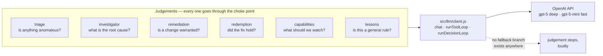
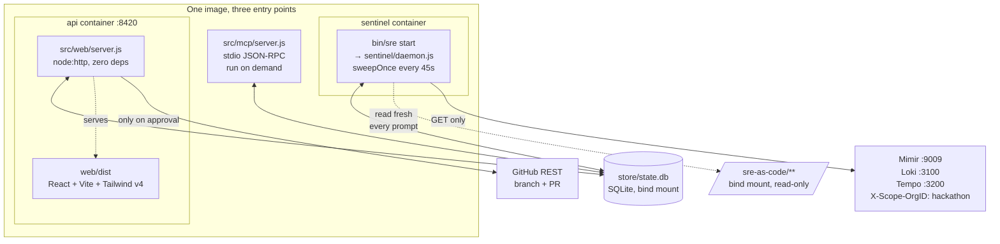
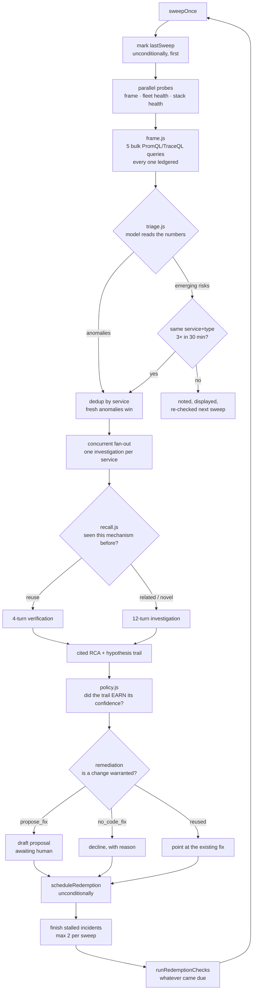
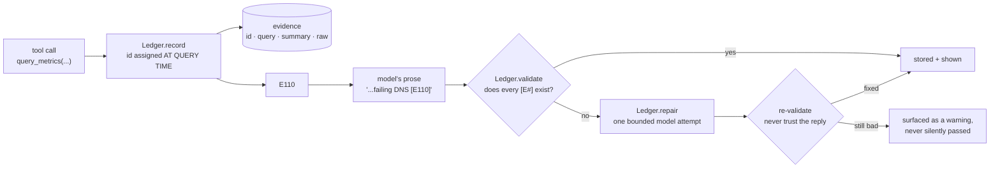
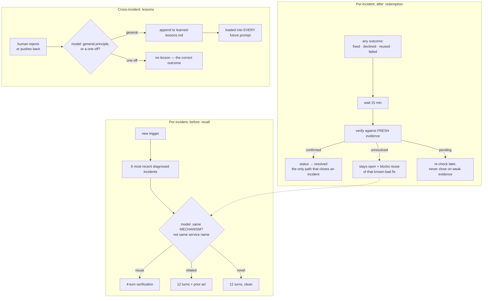
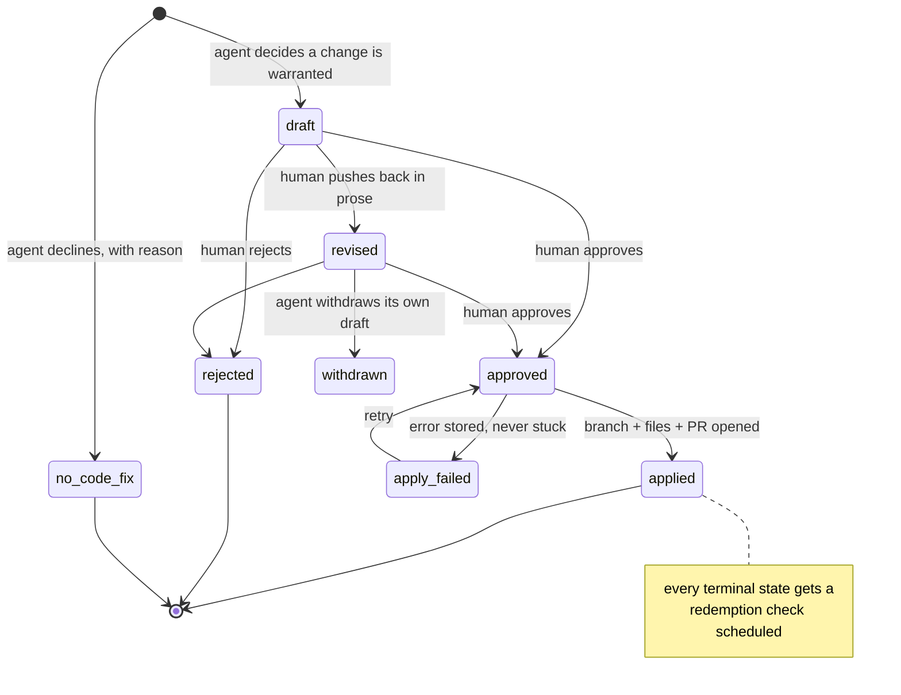
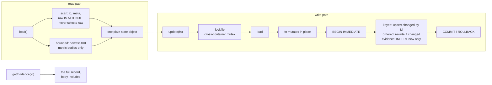

# SREonCall — system architecture

An autonomous SRE agent for a live 18-service microservices fleet. It watches the fleet on its
own, decides what is worth investigating, investigates it, writes a cited root-cause analysis,
decides whether a repo change is warranted, drafts one, waits for a human to approve it, opens
the PR, and comes back later to check whether the fix actually worked.

Nobody clicks anything to start any of that. The only human action in the whole system is the
approval on the one step that writes to a system outside this one.

**The load-bearing claim, stated so it can be falsified:** delete `src/llm/client.js` and there
is no detection, no triage, no RCA, no remediation decision, no verification, and no summary.
Nothing degrades to a simpler version — it stops existing. That is the difference between
AI-native and AI-enabled, and the rest of this document is how it is enforced rather than
asserted.

---

## 1. The choke point

Every judgement in the system routes through one file.



Three call shapes, and the difference between them matters:

| Shape | Used by | Exit condition |
|---|---|---|
| `chat()` | triage, recall, lessons, fleet summary | one request, one answer |
| `runToolLoop()` | investigation | the model stops calling tools (max 12 turns) |
| `runDecisionLoop()` | remediation authoring, recovery verification | the model calls a **terminal tool**, returned *unexecuted* so the caller interprets it |

`runDecisionLoop` exists because "gather evidence, then decide" is a different shape from
"gather evidence until done". The terminal call (`propose_fix` / `no_code_fix` /
`verify_recovery`) is the exit, and handing it back unexecuted is what keeps the *decision*
with the caller and the *judgement* with the model.

### What happens when the model is unavailable

| Module | On failure |
|---|---|
| `sentinel/triage.js` | throws — sweep fails loudly, retries next interval. **No anomalies invented, none silently skipped as "fine".** |
| `investigator/loop.js` | throws — no incident is created from a failed investigation, ever a placeholder |
| `actions/remediation.js` | throws — no fix drafted from a template |
| `actions/redemption.js` | throws — no incident closes on a failed check |
| `memory/recall.js` | **caught** → `{verdict: "novel", degraded: true}` |
| `actions/explain.js` | **caught** → `null`, the plain-language summary is absent |

The two caught cases are the interesting ones, and neither breaks the rule.

Recall's fallback means *"skip the shortcut, run the full AI investigation as if nothing was
recalled"* — the judgement still happens through the model, just by the longer route. Losing
memory must never mean losing investigation.

`explain.js` produces a narration of numbers that already exist and were computed without any
model involvement. A missing *narration* is not a fabricated *judgement*. Presentation may
degrade; judgement may not.

**No hardcoded thresholds anywhere in a judgement path.** `triage.js` has no numeric cutoff on
purpose — "is 0.4 errors/sec bad?" depends on the service, the hour, and the baseline, and
freezing today's traffic shape into a constant is how an alerting system stops meaning anything.
The constants that do exist (`RISK_ESCALATION_COUNT = 3`, `MAX_CANDIDATES = 6`,
`RESUME_PER_SWEEP = 2`) govern *policy* — how persistent a pattern must be before it earns
budget, how much history to consider — never *what counts as anomalous*.

---

## 2. Runtime topology



Two containers from one image, differing only in `command`, so they fail and restart
independently — a crashed sentinel must never take the review UI down with it. Their
healthchecks differ for the same reason: the API answers `/api/live` (process liveness), while
product readiness — all three telemetry backends reachable *and* a recent successful sweep —
is a separate question at `/api/health`.

The sentinel has no port at all; its healthcheck asks the store whether it has completed a
fresh sweep. A process that is running but has stopped sweeping is exactly the silent failure
worth catching.

**`sre-as-code/` is mounted read-only and read fresh on every reasoning step.** Editing
`practices/incident-response.md` changes how the agent investigates the *next* incident, with no
rebuild and no restart. That is malleability applied to the agent's own operating procedure, not
just to a single conclusion — and it is why the docs are files rather than string literals in
prompts.

---

## 3. The sweep — where initiative lives

`runDaemon()` is a `for (;;)` loop with no exit condition and no human in it.



Eight kinds of initiative, none of them triggered by a person:

1. **Detects** — triage judges the current numbers with no fixed threshold. A quiet fleet
   correctly produces an empty result rather than a padded one.
2. **Decides whether to investigate at all** — recall judges reuse/related/novel *before*
   committing an investigation's budget.
3. **Investigates by trying to be wrong** — the hypothesis-disconfirmation cycle, below.
4. **Decides whether a fix is warranted** — including the discretion to decline.
5. **Schedules its own follow-up** — unconditionally, whatever the outcome was.
6. **Checks its own work later** — re-verifies against telemetry that did not exist when the
   conclusion was written.
7. **Learns from what it finds** — an unresolved check blocks that fix from being reused.
8. **Escalates a pattern too quiet for any single sweep** — an emerging risk noted three times
   in thirty minutes graduates into a real investigation.

Two subtleties in that last one. The escalation count governs *persistence policy*, never what
counts as anomalous — that stays triage's live judgement, made fresh every sweep. And a service
flagged as **both** a fresh anomaly and a newly-escalated risk in the same sweep must not fan
out into two concurrent investigations, so the combined list is deduped by service before the
fan-out, fresh anomalies taking priority.

**Finishing its own unfinished work.** An incident with a concluded RCA and no remediation
outcome is a diagnosis nobody ever decided what to do about — it happens when a process dies
between investigating and deciding, or when an incident predates the remediation path being
wired in. Each sweep picks up two of them and runs the same model-driven decision a fresh
incident gets. It never marks anything resolved, never assumes an old incident is stale, and
treats a *recorded failure* as decided rather than stalled — retrying a failed attempt every
45 seconds would be the blind retry loop an experienced engineer does not do.

---

## 4. Investigation

`investigate()` hands the model a trigger and seven read-only senses:

| Tool | Backend | Purpose |
|---|---|---|
| `query_metrics` | Mimir | arbitrary PromQL |
| `query_logs` | Loki | LogQL over a time window |
| `search_traces` | Tempo | tag-filter search |
| `search_traces_ql` | Tempo | TraceQL |
| `get_trace` | Tempo | one trace, full span tree |
| `compare_baseline` | Mimir | now vs. N minutes ago |
| `derive_baseline` | Mimir | mean / stddev / percentiles over real history |

`derive_baseline` exists so an authored alert rule's comparison is never a guessed number. It
returns a real statistical summary **and an evidence id**, which the PR body must cite.

### Hypothesis discipline

The model is required to tag its reasoning as it goes:

```
HYPOTHESIS[NEW]:          checkout — gRPC calls to payment are failing DNS resolution [E110]
HYPOTHESIS[DISCONFIRMED]: payment itself is erroring — its own error rate is flat [E113]
HYPOTHESIS[REVISED]:      the resolver, not the app — same error across services [E115]
HYPOTHESIS[CONFIRMED]:    checkout→payment DNS resolution failure [E110][E115][E116]
```

The instruction after stating a hypothesis is *"your next move must be a query chosen because
it could prove this wrong"* — not one that piles on confirming detail.

That trail is the malleability audit. A model that states one hypothesis and never revises it
looks identical to one that never tried to disconfirm anything, unless the trail is captured.

### The policy layer — why the trail is checked, not trusted

A model under pressure will happily self-report `CONFIRMED` on the first thing it thought of.
`investigator/policy.js` judges whether the trail *earned* that tag:

- `CONFIRMED` as the only entry → **not disciplined**. It was declared, not tested.
- `REVISED` with no `DISCONFIRMED` anywhere earlier → **not disciplined**. That is a second
  guess, not a response to contradicting evidence.
- Ending on `NEW` or `DISCONFIRMED` → disciplined. An honest mid-cycle stop is not a violation.

An unearned `CONFIRMED` is capped at medium confidence — still usable, since the model may well
be right, but not granted top confidence on a self-report the trail does not support. The reason
is stored on the incident, so a reviewer sees *why* a confidence level landed where it did.

This is deterministic code, and correctly so: it makes no claim about the world, it checks the
*shape* of a self-report the model already produced. Guardrails that constrain a decision should
be deterministic precisely so they cannot be argued around by a clever prompt.

A separate **completion gate** forces one bounded extra turn when a whole signal type is
missing — an RCA built only on metrics, with no log or trace ever consulted, is asked to look
before it finalizes.

---

## 5. Evidence and auditability



**Ids are assigned at query time, not attached to prose afterwards.** That ordering is the whole
mechanism: a claim can only cite evidence that was actually gathered, because the id did not
exist until the query ran. Every `[E#]` chip in the console opens the literal query and the
untouched response.

**Citation repair.** An invented citation used to be logged and shipped anyway across three call
sites. Now the model gets exactly one attempt: shown precisely which ids do not resolve and
every id that does exist, it either re-cites correctly or removes the specific unbacked clause.
The result is re-validated rather than trusted — that is what makes it repair rather than asking
nicely. Bounded to one attempt on purpose: an unbounded loop burns budget chasing a citation the
model may not be able to fix, and genuine failures must still surface.

**Grounding.** `triage.groundedIn` checks a model-named service against the real service list
before it can spawn an investigation for something that does not exist.

**Ids continue from the highest issued, not from the array length.** Found in the live ledger
during the SQLite migration: two entirely different PromQL queries had both been recorded as
`[E88]`, because `E${evidence.length + 1}` collides whenever two entries are appended in one
pass. A citation that resolves to whichever of two rows is found first is a claim nobody can
verify — the one thing this ledger exists to prevent. A gap in the numbering is harmless; a
reused number is not.

---

## 6. Memory — three loops at three scales



**Recall matches by mechanism, not by name.** Two incidents on `checkout` can be a DNS failure
and a payment timeout — same service, entirely different fault. A flagd deadline can surface on
`recommendation` one sweep and `payment` the next — different services, the same fault. Deciding
"is this the same thing?" is a judgement over evidence, so the model makes it; plain code only
narrows the candidate set to keep that judgement cheap.

A `reuse` verdict still runs a live verification. Prior art is a starting point, never a
conclusion — skipping the check would let a stale answer outlive the condition that produced it.

**Redemption is the part most agent demos skip.** A PR being open does not mean it fixed
anything, and a decline does not mean the decline was right. Both are unverified claims wearing
the costume of a resolved incident. The check is scheduled unconditionally for exactly that
reason: an unverified decline is as risky as an unverified fix. Only a `confirmed` check sets
`status: "resolved"` — no other code path does.

**Lessons are the widest loop.** Redemption teaches the agent about *this fix*; a human's
correction may teach it something that should change how it authors *every* future proposal. A
well-argued "no lesson" is a correct outcome — noise in a file loaded into every future prompt
is worse than not having the file.

---

## 7. Ownership — draft, approve, apply, verify



Six guarantees, each one load-bearing:

1. **No write path to the fleet.** `lgtm/client.js` is GET-only by construction. No restart, no
   scale, no flag flip, no config edit function exists to call. When the correct remediation
   *is* an operator action, the agent says so precisely and stops there.
2. **Never commit to a default branch.** `openFixPR()` resolves the default branch sha, creates
   `agent/<incident-id>-<slug>`, writes files, opens a PR. There is no merge call and no
   direct-commit path.
3. **Publishing requires an explicit approval transition.** `applyGithubPrProposal()` *throws*
   unless `status === "approved"`. The status is a precondition, not a label the UI renders.
   The server returns 409 for anything outside `draft`/`revised`/`apply_failed` — without that,
   re-approving an applied proposal opens a **second PR for the same fix**, and approving a
   rejected one silently reverses a human's decision.
4. **Scope is enforced in code.** `ALLOWED_PREFIXES = ["sre-as-code/", "docs/incidents/"]`,
   with traversal rejected, checked *before a human ever sees the draft*. The prompt forbids it
   too, but a model that ignores the prompt must still fail closed. This is what stops the agent
   editing `src/`, `bin/`, or `.env` — its own senses and its own secrets.
5. **It may never reduce what it can see.** No proposal may mute, delete, loosen, or reroute an
   alert, query, or collector so a symptom stops appearing. If a signal is genuinely noisy, the
   only acceptable proposal is a *more precise* one. "The alert stopped firing" is not a
   resolution — it is the agent blinding itself, and the failure would be invisible precisely
   because it succeeded.
6. **A number in an authored rule traces to real evidence.** A structural gate checks in code —
   not just in the prompt — that every authored alert rule carries a rationale citing a real
   `derive_baseline` result before it ships in a PR.

### Declining is a first-class outcome

`no_code_fix` is not a failure. The model is told to reach for it when the root cause is an
operator or flag action, when confidence is too low to justify committing anything, or when
existing rules already cover the failure mode.

**There is deliberately no fallback that emits a generic runbook when the model declines.**
Adding one would convert this system from AI-native to AI-enabled in a single commit — the
output would look the same whether or not the reasoning happened.

Live proof that the discrimination is real: INC-1 (checkout DNS) produced a PR; INC-5 and INC-6
were declined because the traced exception named a feature flag — an operator action, not a code
bug.

### Push back is not an edit form

The reviewer argues in prose; the agent re-authors the change itself and may withdraw it
entirely if the objection shows a repo change was wrong. The prior version is kept in
`proposal.revisions[]` with the feedback that caused it, so the disagreement stays auditable.
Never overwrite a draft in place — the trail is the evidence that the agent adapted rather than
merely being corrected.

---

## 8. Storage

SQLite via `node:sqlite` — built into Node, so the zero-npm-dependency contract holds.



The API is unchanged from the original JSON-file store — `load()`, `save()`, `update()`,
`newIncident()` — because "get a plain object and mutate it" is what keeps the 48 call sites
readable. What changed is underneath:

| | file store | SQLite |
|---:|---:|---:|
| `load()` | 160 ms | **19 ms** |
| `update()` | ~181 ms | **20 ms** |
| `/api/state` | 222 ms | **48 ms** |

Every write used to re-parse and re-serialise the whole 16 MB file under a lock held by two
containers, so cost per write grew with everything ever recorded.

**Two invariants, both tested:**

- **Evidence is append-only.** `load()` hands out most entries *without* their raw body, so a
  substrate that wrote entries back would replace real recorded responses with nothing — and
  citations that used to resolve would silently stop. Existing rows are never updated.
- **A failed `update()` changes nothing.** The callback runs inside a transaction, so a sweep
  that throws halfway leaves no half-applied state.

**Locking is belt and braces on purpose.** The lockfile stays, wrapping each transaction.
SQLite has its own locking, but `store/` is a bind mount shared by two containers, and
file-lock semantics across that boundary are not worth betting correctness on — `O_EXCL`
create is atomic there, which is all this needs. Rollback journal rather than WAL for the same
reason: WAL needs shared memory. `busy_timeout` exists because the first run of this killed a
sweep with `database is locked` when a dashboard poll landed mid-write.

The plain-text property the file gave for free is preserved: `npm run state:export` writes the
whole state, bodies included, back out as JSON.

---

## 9. Interfaces

Four surfaces over the same state, none of which can disagree with the others.

### HTTP API — `src/web/server.js`, `node:http`, zero deps

| Route | Purpose |
|---|---|
| `GET /api/state` | everything the console renders |
| `GET /api/evidence/:id` | one evidence record, body included |
| `GET /api/practices` | the operating procedure the agent is running under |
| `GET /api/live` | process liveness |
| `GET /api/health` | product readiness: all backends + a fresh sweep |
| `POST /api/copilot` | grounded conversational answer |
| `GET /api/copilot/:id` | a persisted thread |
| `POST /api/proposals/:id/{approve,revise,reject}` | the review gate |

`/api/state` withholds raw log and trace bodies from the wire and flags them `rawAvailable` —
they were 5 MB of an 8 MB payload, re-sent on every poll, for data the console only ever reads
one record at a time in the drill-down. **The transport is trimmed, never what the agent can
see**; that distinction has its own test, because those two are one careless edit apart.

### MCP server — `src/mcp/server.js`

The same tool surface the reference platform exposes, over stdio JSON-RPC, zero dependencies.
It turns the agent's capabilities into a protocol rather than a private convention: any
model-driven client gets the read tools and the propose tools, with the guarantees intact.

| Read | Propose |
|---|---|
| `list_incidents` · `get_incident` | `propose_runbook` |
| `get_evidence` · `search_evidence` | `propose_alert_rule` |
| `fleet_health` · `list_proposals` | `propose_change` |

**There is deliberately no approve tool, no apply tool, and no tool that touches the fleet.** A
`propose_*` call is refused outright when a path falls outside the allowlist or the body cites
an evidence id that does not exist. An MCP client is exactly the kind of caller guarantee 3
exists to constrain.

### Console — `web/`, React + Vite + Tailwind v4 + shadcn

Four layers of disclosure, and each component knows which one it is writing:

1. **Headline** — always visible. Service, mechanism, confidence. Reading only this is enough.
2. **Intent** — one click. What the agent wants to *do*. This is the default tab; a conclusion
   with no proposed action is where lesser demos stop.
3. **Analysis** — the full RCA and the reasoning trail.
4. **Raw** — the literal query and untouched response behind a single `[E#]` chip.

No unbounded collection renders inline. 650 emerging signals become one line — *"650 emerging
signals across 12 services, mostly frontend-proxy (120)"* — and a drawer. Leading with the count
and the *shape* is the part a human can act on. It is the product's own thesis applied to its
chrome.

### Command workspace

A conversational surface over work the sentinel has already done — not a second detector and not
a general chatbot. Answers are grounded in the current health reading, open incidents, emerging
risks, reviewable proposals, and the latest 90 evidence records; every operational claim must
cite an id that exists, checked before the response reaches the UI. It can *navigate* to an
incident or a proposal. It cannot approve or execute one — the human gate stays exactly where it
was.

---

## 10. What is deterministic on purpose

Not everything should be a model call, and the line is precise:

> Does this decide something about the world, or does it enforce a boundary on a decision
> already made? The first must be AI. The second must not be.

| Deterministic, correctly | Why |
|---|---|
| `isAllowedPath()` | a guardrail a clever prompt must not be able to argue around |
| proposal status transitions | a safety property, not a judgement |
| the store's lockfile and transactions | correctness, not reasoning |
| `policy.evaluateTrail()` | checks the *shape* of a self-report, makes no claim about the world |
| `groundedIn()` | checks a name against a real list |
| headline / next-step extraction | text extraction from a format the prompt imposed |

---

## 11. Tests

67 assertions, `node --test`, no dependencies, ~100 ms. They encode guarantees, not behaviour —
if one fails, the agent has gained the ability to publish something a human never approved, or
to lose the evidence behind its own claims.

| File | Holds the line on |
|---|---|
| `ownership-safety.test.js` | allowlist fails closed on `src/`, `bin/`, `.env`, traversal; applying a draft or rejected proposal throws; the MCP surface exposes nothing that publishes |
| `store-substrate.test.js` | evidence is append-only; an unrelated write never erases a body; a throwing callback rolls back whole |
| `evidence-ids.test.js` | ids never repeat, so every citation resolves to its own query |
| `investigator-policy.test.js` | an unearned `CONFIRMED` is capped; a revision without a disconfirmation is not disciplined |
| `stalled-incidents.test.js` | a decline and a reuse count as decided; a closed incident is never reopened |
| `api-payload.test.js` | the wire may drop bodies; the record may not lose them |
| `rca-presentation.test.js` | prompt scaffolding is stripped without eating real content |
| `runtime-health.test.js` | liveness and readiness stay different questions |

---

## 12. File map

```
src/
  llm/client.js          the choke point — chat, runToolLoop, runDecisionLoop
  lgtm/client.js         GET-only Mimir/Loki/Tempo access
  lgtm/health.js         per-service probe + stack probe + sentinel freshness
  evidence/ledger.js     record, validate, repair, nextId
  store/state.js         SQLite substrate, lockfile, transactions
  practices.js           loads sre-as-code/practices/*.md fresh, every prompt

  sentinel/frame.js      5 bulk queries → one numeric frame, all ledgered
  sentinel/triage.js     the model judges the frame; grounding check
  sentinel/daemon.js     the agency loop: sweep, escalate, fan out, resume, verify

  investigator/tools.js  the 7 read-only senses
  investigator/loop.js   hypothesis discipline, completion gate, cited RCA
  investigator/policy.js did the trail earn its confidence?

  memory/recall.js       reuse | related | novel, by mechanism
  memory/lessons.js      a human correction → a durable general rule

  actions/remediation.js decide + author, or decline
  actions/proposals.js   draft → approved → applied state machine
  actions/github.js      branch + files + PR, the only external write
  actions/redemption.js  did it actually work?
  actions/explain.js     plain-language fleet summary

  capabilities/          live discovery + model-chosen monitoring capabilities
  copilot/assistant.js   grounded conversational answers
  web/server.js          read-only JSON API + the review gate
  mcp/server.js          the same machinery, as a protocol

sre-as-code/             the agent's operating procedure — editable, no rebuild
  practices/             incident-response · learned-lessons · guardrails
  alert-rules/ runbooks/ slos/    what the agent may propose changes to
```

---

## 13. Known limits

- **Redemption has not yet produced a `confirmed`.** The loop runs and is scheduled on every
  decided incident, but no incident has been verified closed yet — so "outcome verification" is
  built and exercised, not yet demonstrated end to end.
- **The shared LGTM stack times out intermittently.** Sweeps fail loudly and retry, which is the
  designed behaviour, but a demo can land on one.
- **`store/state.json` is a frozen snapshot**, imported once on first boot. It is how a fresh
  clone comes up with real incidents; it is no longer written to.
